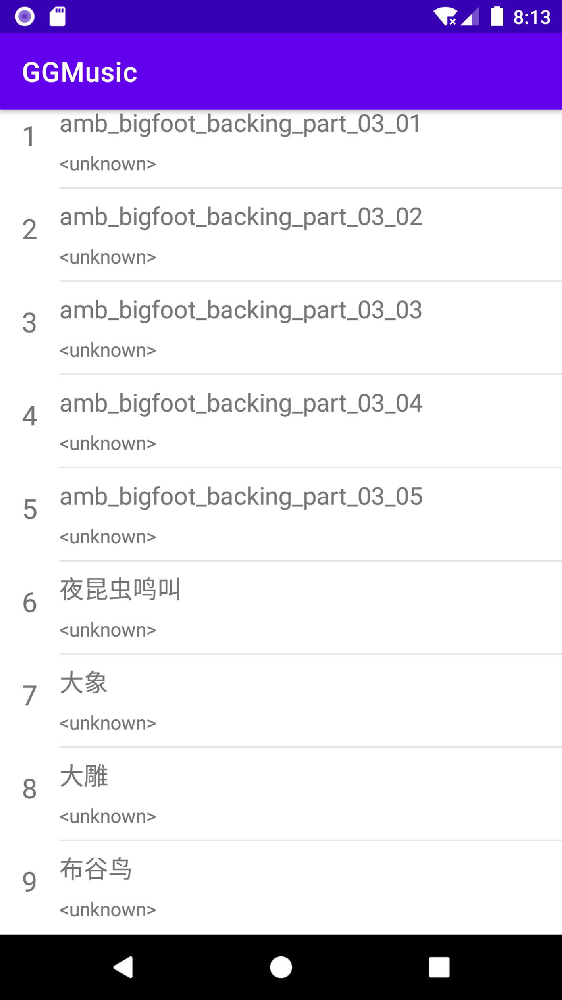
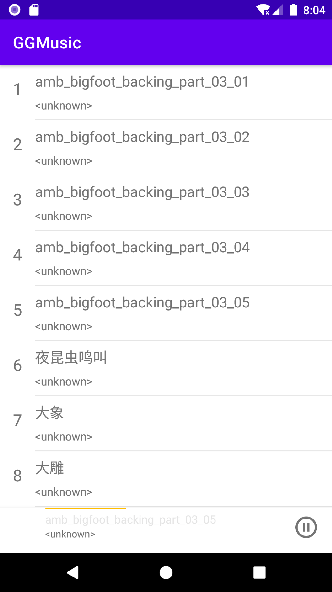

# GGMusic

音乐播放器1

# 重要步骤:

1.将歌曲拖至屏幕即可自动保存至虚拟机相应存储

2.media-rescan程序(已经上传至本项目)点击START MEDIASCAN

3.app/build.gradle处设置改为settings.gradle下的repositories

```xml
allprojects {repositories {jcenter()maven() { url "https://maven.google.com"}}}
```

4.AS重构,用于解决代码依赖版本迭代产生的问题:REFACTOR->MIGRATE TO ANDROIDX

# 参考

https://github.com/xgqin/android_dev_music_player

# 效果图

## 一:



## 2/3

可以在后台运行
